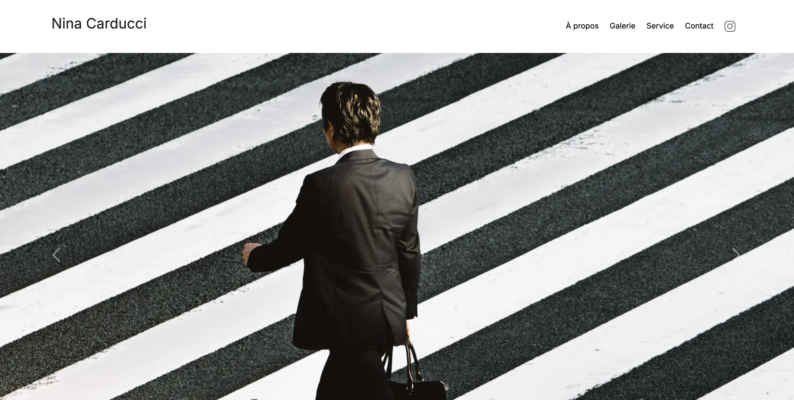

# Portfolio de Nina Carducci - Photographe

- Ce travail a été réalisé dans le cadre du projet n°8 de la formation Intégrateur Web d’OpenClassrooms.
- Ce projet est le portfolio en ligne de Nina Carducci, une photographe basée à Bordeaux.
- L'objectif du site est de présenter ses travaux tout en garantissant :
	- • une accessibilité exemplaire pour tous les utilisateurs,
	- • des performances de chargement optimisées,
	- • un référencement naturel (SEO) efficace.

## Fonctionnalités

- **Galerie interactive** : Navigation à travers différentes catégories (mariages, portraits, concerts).
- **Optimisation technique** : Correction de bugs (débogage) et amélioration de la structure sémantique.
- **Contact** : Formulaire permettant aux visiteurs de solliciter des collaborations.

## Outils et langages pour la réalisation du projet

- Le projet a été réalisé avec **HTML5**, **CSS3**, **JavaScript**, **Bootstrap** et **jQuery**.
- Les tests de performance ont été effectués via **Lighthouse** et **Wave**.